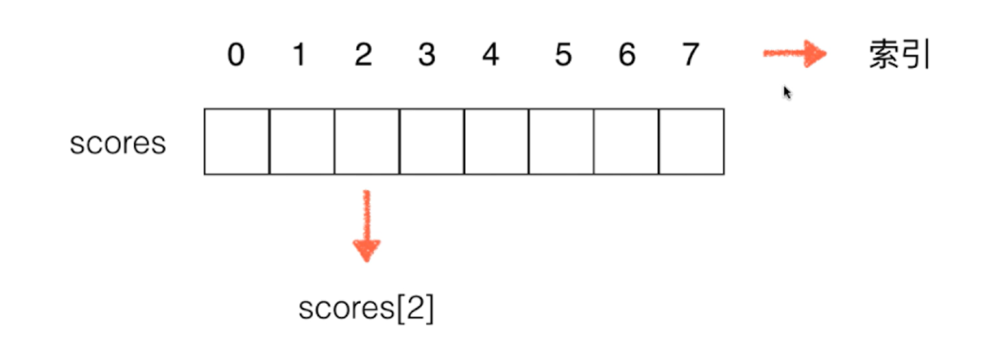

# 数组

### 概念

将数据排成一排存放


### 重点

**索引** - 从0开始到 **n-1**


### 图片



### 创建数组

```java
// 创建一个固定长度的数组
int[] arr = new int[10];

// 创建一个数组并赋值
int[] scores = new int[]{100, 99, 66};
```


### 数组的遍历

```java
int[] scores = new int[]{100, 99, 66};

for (int score: scores) {
    System.out.println(score);
}
```


### 数组的修改

```java
scores[1] = 20;
```


### 局限性

数组有长度